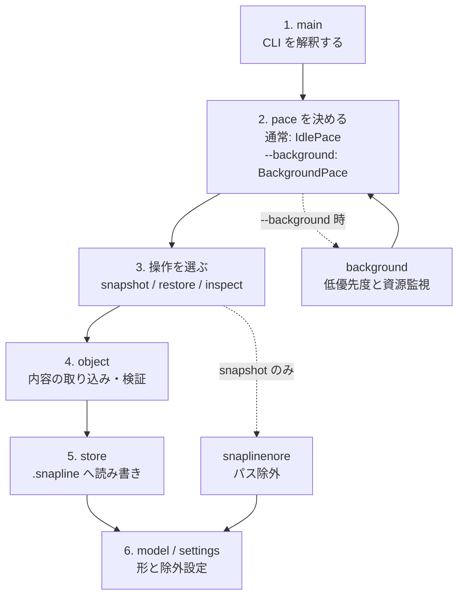

# モジュール関係

Snapline の処理は、どのコマンドでも同じ流れを通る。
変わるのは「どのペースで進めるか」と「どの操作か」だけである。

## 処理の流れ



上から下へ読む。

1. `main` がコマンドを受け取る
2. ペースを決める（通常は待機なし、`--background` なら監視付き）
3. 同じ操作モジュールを呼ぶ（`snapshot` / `restore` / `inspect`）
4. ファイル実体は `object` が扱う
5. 置き場所とマニフェストは `store` が扱う
6. データの形と除外設定は `model` / `settings`（記録時は `snaplinenore` も）

`install` だけはこの流れの外で、実行ファイルの PATH 登録だけを行う。

## 通常と --background の違い

違いは **2. ペース** だけである。操作・包含除外・検証ルールは同じ。

| | 通常 | `--background` |
| --- | --- | --- |
| ペース | `IdlePace`（何もしない） | `BackgroundPace`（CPU/メモリ監視・低優先度） |
| 呼び方 | `snapline snapshot` など | `snapline --background snapshot` など |
| 本体 | 同じ `_with_pace` 経路 | 同じ `_with_pace` 経路 |

## モジュール一覧

| モジュール | 流れ上の位置 | 役割 |
| --- | --- | --- |
| `main` | 1 | CLI 解釈と振り分け |
| `progress` | 1→3 | 進捗は stderr、結果は stdout。区切りに空行 |
| `pace` | 2 | I/O 待機の共通口 |
| `background` | 2（任意） | `BackgroundPace` の実装 |
| `snapshot` | 3 | 記録 |
| `restore` | 3 | 復元 |
| `inspect` | 3 | 一覧（`log`）・検証 |
| `object` | 4 | ハッシュ化・圧縮・検証付き I/O |
| `store` | 5 | `.snapline` 構造・ロック・マニフェスト |
| `model` | 6 | オンディスク JSON の型 |
| `settings` | 6 | 除外設定と既定値 |
| `snaplinenore` | 3→6 | 階層 `.snaplinenore` |
| `install` | （別） | PATH 登録 |

## 依存の向き

利用する側から利用される側へ向かう。循環はない。

```text
main
  → pace / background
  → snapshot / restore / inspect
      → object → store → model → settings
      → pace
      → snaplinenore → settings   （snapshot のみ）
  → store                         （init / config）
  → install                       （install）
```

## コマンドごとの経路

すべて「ペース → 操作 → object/store」の形に揃う。

| コマンド | 経路 |
| --- | --- |
| `init` / `config` | `main` → `store` |
| `log` | `main` → `inspect::list_log_rows`（欠落要約は自動補完）→ `store` |
| `snapshot` | `main` → IdlePace → `snapshot` → `object` / `store` |
| `restore` | `main` → IdlePace → `restore` → `object` / `store` |
| `verify` | `main` → IdlePace → `inspect::verify` → `object` / `store` |
| `--background snapshot` など | `main` → BackgroundPace → 同じ操作 → `object` / `store` |
| `install` | `main` → `install` |

## 変更時の目安

| 変えたいこと | 見る場所 |
| --- | --- |
| CLI や振り分け | `main` |
| 待機・低優先度 | `pace` / `background` |
| 記録・復元・検証の手順 | `snapshot` / `restore` / `inspect` |
| 圧縮・ハッシュ形式 | `object` |
| ストア配置 | `store` |
| 除外ルール | `settings` / `snaplinenore` / README の包含節 |
